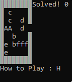
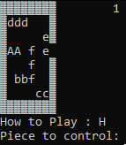
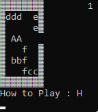
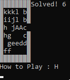

# Unblocked





# FAQ
* [What is Unblocked?](https://play.google.com/store/apps/details?id=com.kiragames.unblockmefree&hl=en_US)(Ctrl + click) the link
* Does this work on Linux?
    - Sadly no, due to libraries used in the code.
* Does this work on Windows
    - Yes, below instructions are provided.

# Install for windows
1. Download zip to Downloads
2. Unzip Unblocked-master
    * right-click & **extract here**
3. [gcc/g++ Compilers (used to compile and play)](https://iweb.dl.sourceforge.net/project/tdm-gcc/TDM-GCC%20Installer/tdm64-gcc-5.1.0-2.exe)(Ctrl + click) the link
    * run & install
    * Video on how to install the compilers [Compiler Installation Tutorial](https://youtu.be/w23QyVb1Jx4)(Ctrl + click) the link
    * If you have installed them once, you don't need to again
4. Press together: ```Win + R```
5. type & enter: ```cmd```
6. type & enter: ```cd Downloads``` to **c**hange **d**irectory to your Downloads
7. type & enter: ```cd Unblocked-master```
8. type & enter: ```g++ main.cpp -o run```
9. Read ```How to play``` before playing
10. type & enter: ```run```

# How to play :
1. **Controls**:
    * Horizontal pieces Move : left or right
    * Vertical pieces Move : up or down
        - w : UP
        - a : DOWN
        - s : LEFT
        - d : RIGHT
    * . : pick piece to control _(a-z, if exisits)
    * [ : previous map
    * ] : next map
    * R : reset current map
    * q : cycle pieces backwards
    * e : cycle pieces forwards
    * C : quits game
    
    
# How to edit :
1. **Enter/Exit**
    * / : to enter editing mode (cursor will appear)
    * Z : to exit editing mode

# Once in editing mode:
1. **Movement**
    * w : UP
    * a : DOWN
    * s : LEFT
    * d : RIGHT
2. **Edits**
    * (1-4) will generate a new piece with given dimensions originating from the cursor to the right or below the cursor
        - 1 : height = 1 width = 2
        - 2 : height = 1 width = 3
        - 3 : height = 2 width = 1
        - 4 : height = 3 width = 1
    
    * \+ : create new map
    * \- : deletes block sharing a location with the cursor
    * | : save changes
    * _ : delete current map